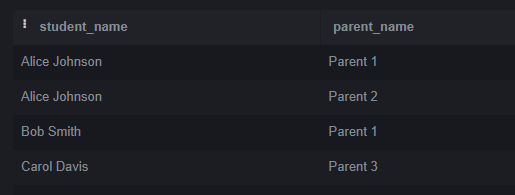

# НИЯУ МИФИ. ИИКС. Лабораторная работа №1-2. «Сложные запросы на выборку. Соединения». Ступников Иван, Б20-505. 2023.

## Список выполненных простых запросов SQL 

### Создание и заполнение таблиц
   Был выполнен [SQL сценарий для создания таблиц в SQLite](./school.sql). 

   Результат: создания таблицы 
  
  Созданы тестовые записи в таблице school. 
  ```
  INSERT INTO teachers (name) VALUES
  ('John Smith'),
  ('Jane Doe'),
  ('David Johnson');

INSERT INTO subjects (name) VALUES
  ('Mathematics'),
  ('Science'),
  ('History');

INSERT INTO groups (name) VALUES
  ('Group A'),
  ('Group B'),
  ('Group C');

INSERT INTO students (name, group_id) VALUES
  ('Alice Johnson', 1),
  ('Bob Smith', 1),
  ('Carol Davis', 2),
  ('David Wilson', 3);

INSERT INTO schedule (group_id, subject_id, teacher_id, schedule_date) VALUES
  (1, 1, 1, '2023-05-22'),
  (1, 2, 2, '2023-05-23'),
  (2, 3, 1, '2023-05-24'),
  (3, 1, 3, '2023-05-25');

INSERT INTO grades (student_id, subject_id, grade, date) VALUES
  (1, 1, 90, '2023-05-22'),
  (1, 2, 85, '2023-05-23'),
  (2, 1, 95, '2023-05-22'),
  (2, 2, 92, '2023-05-23'),
  (3, 3, 88, '2023-05-24'),
  (4, 1, 87, '2023-05-25');

INSERT INTO parents (name) VALUES
  ('Parent 1'),
  ('Parent 2'),
  ('Parent 3');

INSERT INTO studentparents (student_id, parent_id) VALUES
  (1, 1),
  (1, 2),
  (2, 1),
  (3, 3);

INSERT INTO attendance (student_id, date, status) VALUES
  (1, '2023-05-22', 'Present'),
  (1, '2023-05-23', 'Present'),
  (2, '2023-05-23', 'Absent'),
  (3, '2023-05-24', 'Present'),
  (4, '2023-05-25', 'Present');

  ```
### Простые запросы на выборку
  1. Вывести имена студентов, их группы и средний балл по предметам:
   ```
  SELECT s.name AS student_name, g.name AS group_name, AVG(grade) AS average_grade
FROM students s
JOIN groups g ON s.group_id = g.group_id
JOIN grades gr ON s.student_id = gr.student_id
GROUP BY s.student_id;
  ```
  
  
  2. Вывести расписание занятий для каждой группы, включая информацию о предмете и имени преподавателя:
   ```
  SELECT g.name AS group_name, s.name AS subject_name, t.name AS teacher_name
FROM schedule sc
JOIN groups g ON sc.group_id = g.group_id
JOIN subjects s ON sc.subject_id = s.subject_id
JOIN teachers t ON sc.teacher_id = t.teacher_id;
  ```
  
  
  3. Вывести имена студентов, их средний балл и статус посещаемости на последнем занятии:
   ```
  SELECT s.name AS student_name, AVG(g.grade) AS average_grade, a.status AS attendance_status
FROM students s
JOIN grades g ON s.student_id = g.student_id
JOIN attendance a ON s.student_id = a.student_id
WHERE a.date = (
  SELECT MAX(date) FROM attendance
)
GROUP BY s.student_id;
  ```
  
  
  4. Вывести список студентов и их родителей:
   ```
  SELECT s.name AS student_name, p.name AS parent_name
FROM students s
JOIN studentparents sp ON s.student_id = sp.student_id
JOIN parents p ON sp.parent_id = p.parent_id;

  ```
  
  
  5. Вывести список предметов, для которых есть оценки, и общее количество студентов, получивших оценки:
   ```
  SELECT s.name AS subject_name, COUNT(DISTINCT g.student_id) AS total_students
FROM subjects s
JOIN grades g ON s.subject_id = g.subject_id
GROUP BY s.subject_id;
  ```
  
  
  6. Вывести группы, в которых есть студенты, не имеющие оценок:
   ```
  SELECT g.name AS group_name
FROM groups g
LEFT JOIN students s ON g.group_id = s.group_id
LEFT JOIN grades gr ON s.student_id = gr.student_id
WHERE gr.student_id IS NULL;
  ```
  
  
  7. Вывести имена преподавателей и средний балл по их предметам, отсортированные по убыванию среднего балла:
   ```
  SELECT t.name AS teacher_name, s.name AS subject_name, AVG(g.grade) AS average_grade
FROM teachers t
JOIN schedule sc ON t.teacher_id = sc.teacher_id
JOIN subjects s ON sc.subject_id = s.subject_id
JOIN grades g ON s.subject_id = g.subject_id
GROUP BY t.teacher_id, s.subject_id
ORDER BY average_grade DESC;

  ```
  
  
  8. Вывести список студентов, у которых средний балл выше среднего балла всех студентов:
   ```
  SELECT s.name AS student_name, AVG(g.grade) AS average_grade
FROM students s
JOIN grades g ON s.student_id = g.student_id
GROUP BY s.student_id
HAVING AVG(g.grade) > (
  SELECT AVG(grade)
  FROM grades
)
  ```
  

## Заключение
База данных была заполнена тестовыми данными. На этих данных были выполнены простые запросы на выборку, которые могут понадобиться при работе данного магазина.

